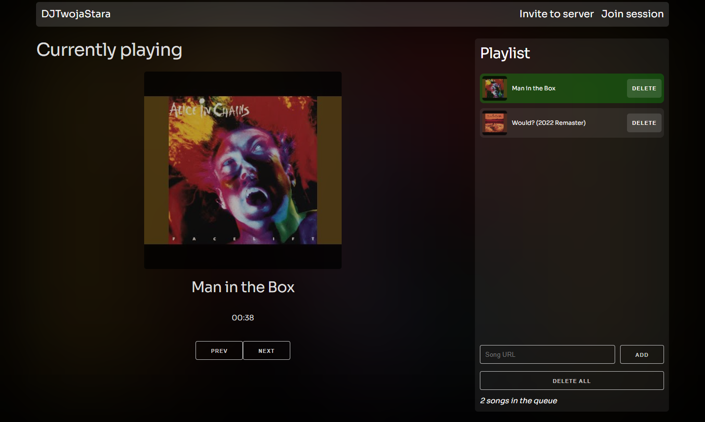

# DJ Twoja stara
*Shitty discord bot with support for Youtube*

## Features

* Play music from youtube
* Play entire playlists
* Slash commands
* Web UI
  * Add songs to queue
  * Remove songs from queue
  * prev/next song
  * No login required
* Queue
* Equalizer
* Custom audio pipeline, no dependencies on lavalink or other external services
* Sane programming language (C#)



## Usage

You can use a docker one-liner to run the bot.

```shell
docker run sowa705/djtwojastara:latest -p 8080:80 -e TOKEN=your_token_here
```

## Building

Running in docker takes care of all dependencies and is recommended.

```shell
docker build -t djtwojastara .
docker run -p 8080:80 djtwojastara -e TOKEN=your_token_here
```

## Local development

1. Set up your tokens:
    ```shell
    cd src/DJTwojaStara
    dotnet user-secrets set Token "your_token_here"
    dotnet user-secrets set YoutubeApiKey "your_youtube_api_key_here"
    ```
1. Start up the web server:
    ```shell
    cd ../DJTwojaStara-UI
    npm run dev
    ```
1. Run the bot from your IDE